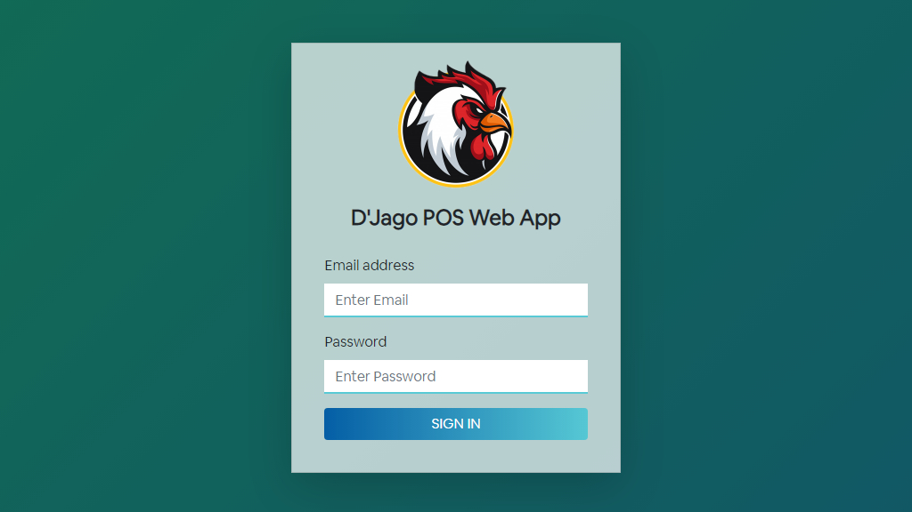
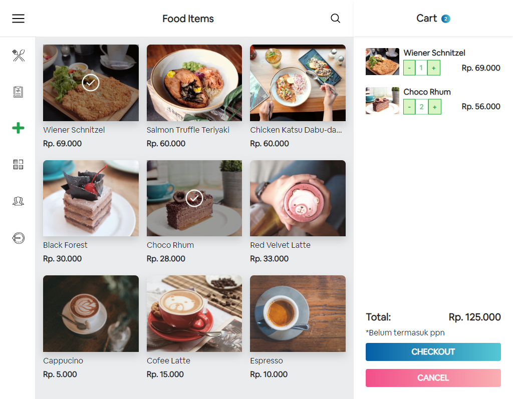
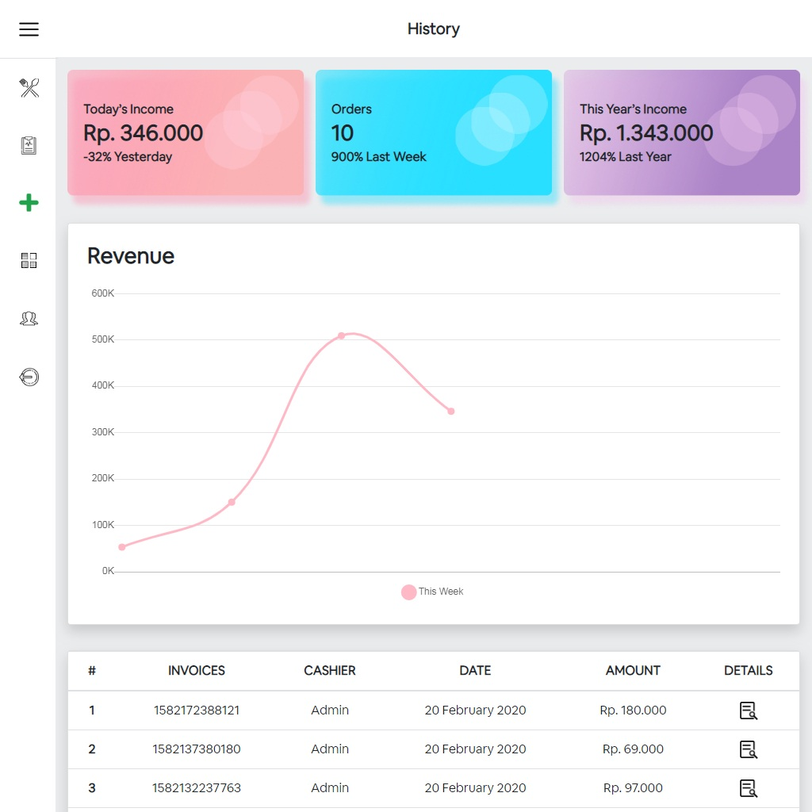
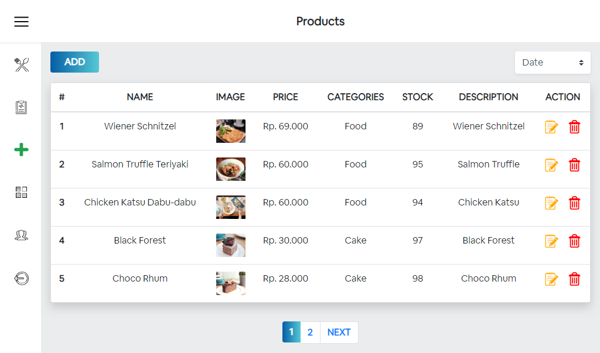
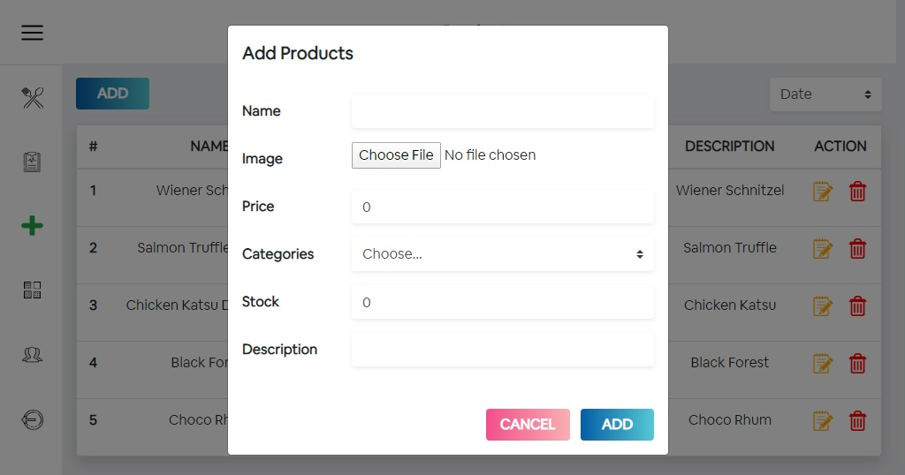

<h1 align="center">
  <br>
  
  <br>
  D'Jago Frontend React Redux
  <br>
</h1>

<h4 align="center">D'Jago Frontend React Redux is a Point of Sale React Web App. Written in React Js with Redux, it uses Restful API data storage back-end.</h4>

<p align="center">
  
  
  
  
</p>

<p align="center">
  <a href="#feature">Feature</a> •
  <a href="#demo">Demo</a> •
  <a href="#how-to-use">How To Use</a> •
  <a href="#related-project ">Related Project</a>
</p>

## Feature

- Login and Register User.
- CURD User, Categories and Products.
- Add/Reduce Products Order
- File Image Upload on product.
- Search product by name.
- Sort product by name, category, date.
- Products page pagination.
- Reporting on income today, yearly, and orders weekly.
- Use Chart.js
- Use Bootstrap Framework
- Use SweetAlert2.js
- Use Redux

## Demo

_Login_



_Sales_



_History_



_Products_



_Add Product_



## How To Use

1. Clone this repository
   ```
   $ git clone https://github.com/argadeva/djago-frontend-react-redux.git
   ```
2. Install all depedencies on the package.json
   ```
   $ cd djago-frontend-react-redux
   $ npm install
   ```
3. Run
   ```
   $ npm start
   ```

## Related Project

- [`D'Jago Backend RestFulAPI (Back-end Web App)`](https://github.com/argadeva/djago-backend-restfulapi)
- [`D'Jago React Native (Mobile App)`](https://github.com/argadeva/djago-react-native)
